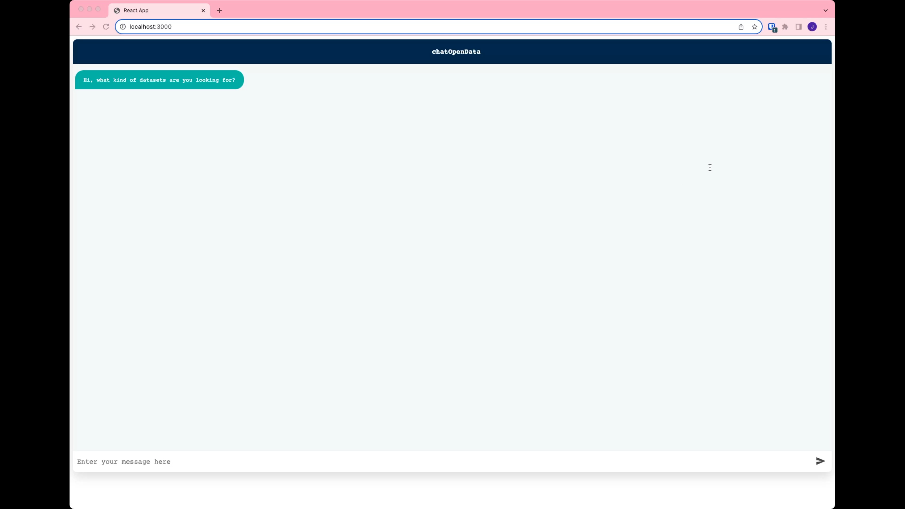
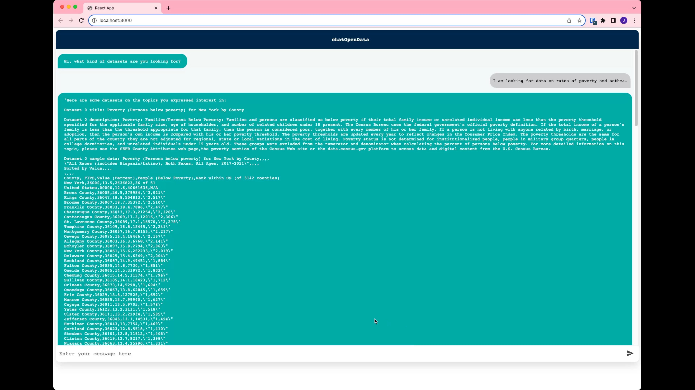
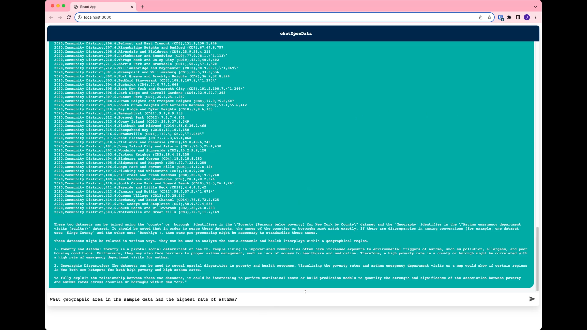
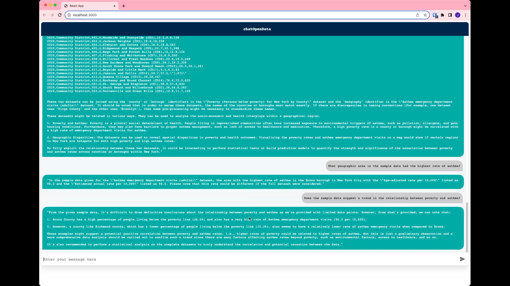

# chatOpenData (NASA Space Apps Challenge 2023 project)

chatOpenData is a chatbot that helps users find groups of interdisciplinary related datasets, discover how the datasets are related and can be combined, and ask questions of and analyze the datasets.

It is powered by GPT-4, PostgresQL with pgVector for vector database powered dataset search, Hugging Face all-MiniLM-L6-v2 for embeddings, SQLAlchemy, FastAPI and React.

## Screenshots

   

## Setup

Ensure you have access to a Postgres database with the pgVector extension installed.

Copy the `.env.example` file to `.env` and your own database URI and API tokens.

Ensure `pipenv` is installed and install dependencies using `pipenv install`.

Run `db/populate.py` to create DB schema and populate with sample data. Sample run configuration can be found in `.vscode/launch.json`.

## Running

Run the "Run API" configuration in `.vscode/launch.json`. The API will by default be served on port 8000. The sample data includes datasets on air quality, asthma and poverty rates.

## Frontend

See [our frontend repo](https://github.com/jasonreed7/nasa-space-apps-2023-chat-open-data-frontend) for a simple chatbot UI interface to communicate with our API.
